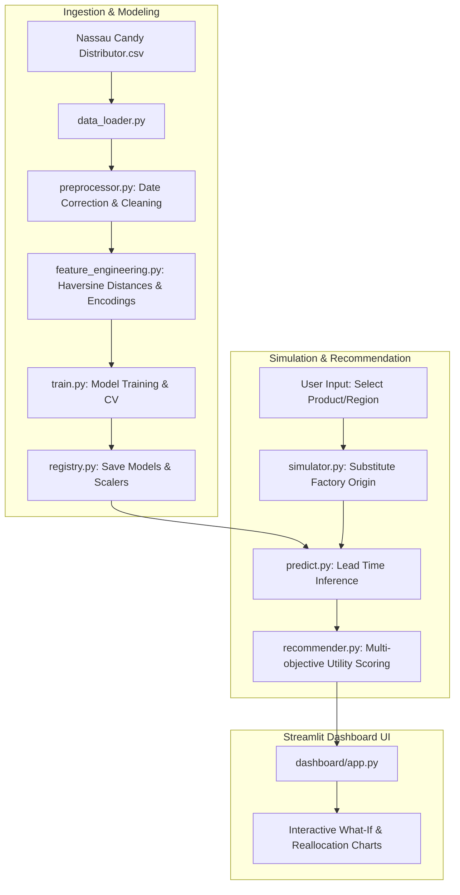

# System Architecture Design: Nassau Candy Factory Reallocation & Shipping Optimization
**Document Type:** System Architecture Blueprint  
**Audience:** Technical Leadership & Development Team  
**Prepared by:** Principal Solution Architect  

---

## 1. Project Folder Structure & Module Directory
We adhere to a modular, clean-architecture pattern that separates concerns between data ingestion, model lifecycle, optimization algorithms, and frontend presentation.

```
Nassau-Candy-Factory-Optimization/
├── README.md                           # Project summary and quickstart guide
├── requirements.txt                    # Project library dependencies
├── .gitignore                          # Standard git ignore definitions
├── config.yaml                         # Centralized environment & model parameters
├── data/
│   ├── raw/                            # Ingestion directory for raw CSV files
│   └── processed/                      # Output directory for encoded/cleaned datasets
├── notebooks/                          # Jupyter Notebooks for exploratory data analysis (EDA)
├── models/                             # Serialized ML model binaries (.joblib / .pkl)
├── src/                                # Core codebase
│   ├── __init__.py
│   ├── data/                           # Data Ingestion & Cleansing Layer
│   │   ├── __init__.py
│   │   ├── data_loader.py
│   │   └── preprocessor.py
│   ├── features/                       # Feature Extraction & Pipeline Encoding
│   │   ├── __init__.py
│   │   └── feature_engineering.py
│   ├── models/                         # Predictive ML Pipeline
│   │   ├── __init__.py
│   │   ├── train.py
│   │   ├── predict.py
│   │   └── registry.py
│   ├── optimization/                   # Scenario Simulation & Optimization Engines
│   │   ├── __init__.py
│   │   ├── simulator.py
│   │   └── recommender.py
│   └── utils/                          # Utility & Cross-Cutting Concerns
│       ├── __init__.py
│       ├── config.py
│       ├── logger.py
│       └── exceptions.py
├── dashboard/                          # Streamlit UI Layer
│   ├── app.py                          # Streamlit app main entry point
│   └── views/                          # Sub-pages and visualization tabs
│       ├── simulator_view.py
│       ├── scenario_view.py
│       ├── recommendation_view.py
│       └── risk_view.py
└── tests/                              # Automated Test Suite
    ├── __init__.py
    ├── test_data.py
    ├── test_models.py
    └── test_optimization.py
```

---

## 2. Python Modules & Rationale
Below is the justification for each module's existence within the solution architecture:

### 2.1 Data Layer (`src/data/`)
* **`data_loader.py`:** Handles I/O operations from raw sources (CSV, SQL Databases). Isolates file reading logic and handles initial schema validation.
* **`preprocessor.py`:** Standardizes data types, handles missing values, removes statistical outliers, and corrects the date discrepancy. It calculates the raw shipping lead time in days and adjusts the year offsets to convert the historical 3-year gap into simulated business days.

### 2.2 Feature Engineering Layer (`src/features/`)
* **`feature_engineering.py`:** Generates modeling variables. Features include:
  * **Haversine Distance:** Calculates geographic distances between factory lat/long coordinates (source) and customer cities/states coordinates (destination).
  * **Categorical Encoders:** Fits and transforms categorical fields (e.g., `Region`, `Ship Mode`) into modeling formats.
  * **Temporal Features:** Extracts seasonal indicators (e.g., `Order Month`, `Order Quarter`) to capture demand cycles.

### 2.3 Machine Learning Pipeline (`src/models/`)
* **`train.py`:** Runs model training. Trains Regressor baselines (Linear Regression, Random Forest, Gradient Boosting), performs hyperparameter tuning via cross-validation, and outputs validation metrics (RMSE, MAE, R²).
* **`predict.py`:** Exposes a clean API for inference. Accepts runtime variables (Product, Origin Factory, Destination Region, Ship Mode) and returns predicted lead times.
* **`registry.py`:** Manages model persistence. Handles saving trained models, encoders, and scaler objects with version metadata, and safely deserializes them during inference or simulation.

### 2.4 Scenario Simulation & Optimization (`src/optimization/`)
* **`simulator.py`:** The "What-If" engine. For any selected product, it overrides the current factory association with each of the other four factories, recalculates distance-based features, and calls `predict.py` to simulate lead times across all potential routes.
* **`recommender.py`:** Evaluates simulated routes and ranks them. It scores candidates using a multi-objective utility function that factors in predicted lead time reduction, shipping cost impact (margin stability), and operational transition risk.

### 2.5 Utilities (`src/utils/`)
* **`config.py`:** Centralized configurations manager using a safe YAML parser. Exposes structured parameters globally.
* **`logger.py`:** Centralized log engine implementing Python standard logging.
* **`exceptions.py`:** Defines custom system exceptions, making error handling clean and trace-friendly.

---

## 3. Data Flow Architecture
The data flow is structured into three phases: Ingestion/Training, Simulation, and Recommendation/Display.



---

## 4. Machine Learning & Recommendation Engine Pipeline

### 4.1 ML Pipeline Details
1. **Preprocessing Pipeline:** Data passes through `preprocessor.py` where outliers are removed using the Interquartile Range (IQR) on unit sales and lead times.
2. **Feature Pipeline:** Categorical features (`Region`, `Ship Mode`, `Division`) are encoded using `TargetEncoder` or `OneHotEncoder`. Coordinates of the 5 factories are mapped to order records to calculate distance.
3. **Training & Validation:** We execute a stratified K-Fold cross-validation split (by `Region` and `Division`) to prevent regional data leakage.
4. **Model Evaluation:** The system evaluates performance using:
   $$\text{RMSE} = \sqrt{\frac{1}{n}\sum_{i=1}^n(y_i - \hat{y}_i)^2}, \quad \text{MAE} = \frac{1}{n}\sum_{i=1}^n|y_i - \hat{y}_i|$$

### 4.2 Recommendation Logic (Multi-Objective Optimization)
To recommend a factory change, we calculate a **Utility Score ($U$)** for each alternative factory assignment:

$$U = w_{\text{speed}} \cdot S_{\text{lead\_time}} + w_{\text{profit}} \cdot S_{\text{margin}} - w_{\text{risk}} \cdot R_{\text{transition}}$$

Where:
* $S_{\text{lead\_time}}$: Normalized lead time reduction.
* $S_{\text{margin}}$: Normalized difference in gross profit (revenue minus cost-to-serve).
* $R_{\text{transition}}$: Penalty representing transition complexity (e.g., manufacturing a chocolate product in a sugar-only factory carries high risk).
* $w_{\text{speed}}, w_{\text{profit}}, w_{\text{risk}}$: User-controlled weights defined via UI sliders in the dashboard.

---

## 5. Dashboard Architecture
The Streamlit application uses a modular view structure:
* **`app.py`:** Entry point. Manages session state (storing loaded models, configuration parameters, and user inputs) and global sidebar filters.
* **Simulator View (`simulator_view.py`):** Visualizes the predicted shipping lead times for a single product across all 5 factories.
* **What-If View (`scenario_view.py`):** Compares the *current* network performance (total average lead time, shipping distance, profit) against a *proposed* reallocation setup.
* **Recommendation View (`recommendation_view.py`):** Generates a sorted table of top-N optimal reassignments with expected logistics savings and time reductions.
* **Risk & Impact Panel (`risk_view.py`):** Highlights operational warnings (e.g., capacity bottlenecks, factory mismatch risks).

---

## 6. Configuration Management
Configuration settings are externalized in `config.yaml` to ensure environment parity (Dev, Staging, Prod) without code changes:

```yaml
system:
  env: "production"
  random_state: 42
  test_size: 0.2

data:
  raw_path: "data/raw/Nassau Candy Distributor.csv"
  processed_path: "data/processed/clean_data.csv"
  coordinate_mappings:
    "Lot's O' Nuts": [32.881893, -111.768036]
    "Wicked Choccy's": [32.076176, -81.088371]
    "Sugar Shack": [48.11914, -96.18115]
    "Secret Factory": [41.446333, -90.565487]
    "The Other Factory": [35.1175, -89.971107]

model:
  target: "lead_time_days"
  algorithm: "gradient_boosting"
  hyperparameters:
    n_estimators: 100
    max_depth: 6
    learning_rate: 0.1

optimization:
  default_weights:
    speed: 0.4
    profit: 0.4
    risk: 0.2
```

---

## 7. Logging & Error Handling Strategy

### 7.1 Logging Architecture
Logging is structured using JSON format to standard output (stdout) and rotated log files in `reports/logs/`.
* **INFO level:** Tracks system state changes (e.g., `Model loaded successfully`, `Streamlit session initialized`).
* **WARNING level:** Logs data quality issues (e.g., missing coordinates, unexpected values) and non-blocking model predictions.
* **ERROR/CRITICAL level:** Captures system crashes, model file loading failures, or permission errors.

### 7.2 Custom Error Hierarchy
* **`NassauBaseException`:** Root custom exception.
* **`DataValidationError`:** Raised when input file schemas do not match expectations.
* **`ModelNotFoundError`:** Raised when the inference engine cannot locate the serialized model file.
* **`OptimizationConstraintError`:** Raised when an optimization run violates hard business rules (e.g., moving production to an invalid facility division).

---

## 8. Testing Strategy
We enforce a testing pyramid to ensure system stability before production deployment:

### 8.1 Unit Tests (`tests/`)
* **Data Processing Tests (`test_data.py`):** Validates date parsing, Haversine distance computations, and outlier clipping limits.
* **Inference Tests (`test_models.py`):** Ensures that the `predict.py` module receives correctly formatted data arrays and returns a valid float value for lead time.
* **Optimization Tests (`test_optimization.py`):** Tests that changing utility slider weights adjusts recommended rankings appropriately.

### 8.2 Integration Tests
* Runs end-to-end runs of the pipeline: loading mock raw files, processing, training a model, registering it, running optimization, and generating recommendations.

### 8.3 CI/CD Verification
* Run code style checking (`flake8`/`black`).
* Assert zero compiler/run warnings.
* Require 100% test pass rates and minimum 80% code coverage.
