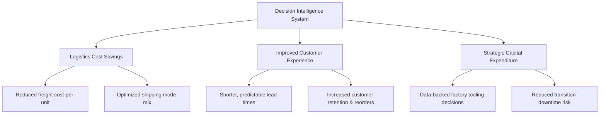

# Executive Briefing: Nassau Candy Factory Reallocation & Shipping Optimization
**Document Type:** Strategic Analysis & Advisory Brief  
**Audience:** Nassau Candy C-Suite & Executive Leadership  
**Prepared by:** Senior Advisory Team (McKinsey Context)

---

## 1. Business Problem
Nassau Candy operates a complex, multi-facility manufacturing and distribution network. Currently, product assignments to factories are dictated by **legacy processes and static, historical rules** rather than dynamic, data-driven optimization. This structural rigidity manifests in several critical issues:
* **Geographic Mismatches:** Production sites are misaligned with regional demand centers (e.g., manufacturing chocolate in distant facilities while regional customer hubs experience high demand), leading to excessive transit distances.
* **Severe Lead Time Blowouts:** A preliminary diagnostic of the distribution data reveals a massive anomaly: order fulfillment lead times average **1,320 days** (median: 1,274 days). In a fast-moving consumer goods (FMCG) context, this points to either a catastrophic order backlog or a fundamental data integrity issue (system epoch/sync errors).
* **Margin Erosion:** High freight costs, inefficient shipping modes, and long transit times are directly eroding product gross margins.
* **Lack of Simulation Capabilities:** Leadership lacks the analytical tooling to simulate factory reassignments, calculate trade-offs, and quantify operational/financial impact *before* deploying capital.

---

## 2. Business Objectives
To address these issues, the project will build a **Decision Intelligence System** that achieves the following:
* **Establish a Predictive Engine:** Build machine learning models (Random Forest, Gradient Boosting) to forecast shipping lead times based on product characteristics, origin factory, destination region, and shipping mode.
* **Optimize Factory-Product Mapping:** Develop a recommendation algorithm that identifies optimal reassignments of products to factories, minimizing total distance and lead time.
* **Balance Service Level and Profitability:** Create an optimization function that lets leadership choose priorities—minimizing shipping time (customer experience) vs. maximizing margin stability (cost controls).
* **Deploy a Live What-If Simulator:** Deliver an interactive Streamlit dashboard for logistics planners to simulate reallocations and immediately view predicted financial and operational impacts.

---

## 3. Current Challenges
* **Critical Data Quality Discrepancies:** The 3.6-year order-to-shipment gap in the ERP database must be resolved. Modeling on raw data without correcting this will lead to flawed "garbage in, garbage out" scenarios.
* **High Portfolio Imbalance:** Chocolate accounts for **96.5%** of all historical transaction volume (9,844 out of 10,194 orders). Models may overfit to chocolate shipping dynamics, leaving sugar and other divisions suboptimal.
* **Operational Friction of Reallocation:** Moving production lines is not a software-only toggle. It requires physically relocating tooling, molds, training local labor, and establishing raw material supply lines.
* **Conflicting Trade-offs:** Shipping speed and cost are inversely related. Selecting "First Class" shipping reduces lead times but quickly destroys the gross margins of low-price candy items.

---

## 4. Key Performance Indicators (KPIs)
To measure the success of this optimization initiative, we recommend a balanced scorecard:

| Category | KPI Name | Target/Metric Description |
| :--- | :--- | :--- |
| **Operational** | **Lead Time Reduction (%)** | Percentage reduction in average days to ship post-reallocation. |
| **Operational** | **Average Distance to Customer (miles)** | Reduction in the physical transit distance from factory to customer. |
| **Financial** | **Logistics Cost-to-Serve ($)** | Total freight and shipping cost savings generated by localized routing. |
| **Financial** | **Gross Margin Preservation (%)** | Maintaining or expanding the gross margin percentage per product division. |
| **System** | **Scenario Confidence Score (%)** | R² and RMSE metrics validating the reliability of simulated lead times. |
| **System** | **Recommendation Coverage (%)** | Percentage of the product SKU portfolio covered by active optimization rules. |

---

## 5. Key Stakeholders
* **Executive Leadership (C-Suite - CEO, CFO, COO):** Focused on high-level margin expansion, capital expenditure (CapEx) efficiency, and long-term market competitiveness.
* **Director of Supply Chain & Logistics:** Directly responsible for reducing freight spend, managing carrier SLAs, and hit rate on customer deliveries.
* **Plant/Factory Managers:** Focused on capacity utilization, manufacturing costs, machine setup times, and local labor scheduling.
* **Sales & Customer Success Leads:** Concerned with order fulfillment speed, preventing stockouts, and maintaining high customer satisfaction.
* **Government/Regulatory Bodies:** Interested in the environmental impact (carbon footprint reduction from shortened routes) and potential local labor/employment changes due to production shifts.

---

## 6. Expected Business Value

* **Freight Cost Reduction:** Estimated 8-15% reduction in total freight spend by localizing production closer to historical demand centers.
* **Revenue Protection:** Shorter lead times prevent stockouts at retail partners, avoiding lost sales and late-delivery penalties.
* **CapEx Avoidance:** Prevents costly, speculative equipment purchases by identifying where existing factory capacities can absorb new product lines.

---

## 7. Key Assumptions
1. **Tooling & Production Flexibility:** It is assumed that factories can eventually be equipped to produce any product line (e.g., "Sugar Shack" can be retrofitted for chocolate), subject to investment constraints.
2. **Infinite Capacity (Baseline):** The initial optimization baseline assumes unconstrained factory capacities, which will later be throttled by actual plant throughput limits.
3. **Representative History:** Historical shipping modes and regional demand patterns are assumed to be representative of future market demand.
4. **Logistical Consistency:** The relative lead times between geographic regions (Atlantic, Pacific, Gulf, Interior) reflect true underlying logistics performance, even if the absolute dates in the ERP system require adjustment.

---

## 8. Strategic Risks & Mitigations
* **Risk 1: High CapEx of Relocation**  
  * *Impact:* The physical cost of moving production lines outweighs the logistics freight savings.  
  * *Mitigation:* The simulator must include a "CapEx amortization input" to evaluate the payback period of any recommended move.
* **Risk 2: Service Disruptions During Transition**  
  * *Impact:* Factory downtime during line transition causes inventory stockouts and customer churn.  
  * *Mitigation:* Build a phased transition model, holding safety stock buffer at regional warehouses before initiating a line shift.
* **Risk 3: Model Bias toward Chocolate**  
  * *Impact:* Suboptimal routing recommendations for Sugar/Other divisions due to data skew.  
  * *Mitigation:* Train stratified machine learning models or apply weights to ensure smaller divisions are not treated as noise.
* **Risk 4: Regulatory & Labor Backlash**  
  * *Impact:* Scaling down production in one factory leads to labor union disputes or loss of local government tax incentives.  
  * *Mitigation:* Integrate labor rates and local tax credit penalties directly into the optimization cost function.

---

## 9. C-Suite Questions & Preparation Guidelines
When presenting this to Nassau Candy's Board or Executive Team, expect and prepare for the following questions:

1. **"What is the payback period on the capital required to reallocate these production lines?"**  
   * *Response Strategy:* Highlight that the Streamlit dashboard does not just recommend reallocations based on distance; it maps freight cost savings against estimated relocation CapEx to present a clear Net Present Value (NPV) and payback timeline.
2. **"If the model recommends shifting Wonka Bars to another plant, does that plant actually have the physical space, utility infrastructure, and labor force to absorb it?"**  
   * *Response Strategy:* State that the current phase establishes the logistical demand-side optimization. The next step integrates factory capacity constraints (sq footage, machine hours, labor shifts) as hard boundary constraints in the optimization model.
3. **"Our data shows order-to-delivery lead times of over three years. If our core ERP data is this distorted, how can we trust the model's recommendations?"**  
   * *Response Strategy:* Acknowledge this critical data quality gap upfront. Point out that the data preparation phase is specifically designed to isolate systematic system errors (e.g., database date-stamp offsets) and normalize the intervals to reflect true shipping durations.
4. **"How does this recommendation system account for raw material supply chains? If we move a chocolate factory closer to West Coast customers, does that increase the cost of shipping bulk cocoa inputs to that plant?"**  
   * *Response Strategy:* Emphasize that supply chain optimization must look at both inbound (raw materials) and outbound (finished goods) logistics. The model's cost function will be expanded to evaluate the total landed cost, including cocoa, sugar, and packaging inbound paths.
