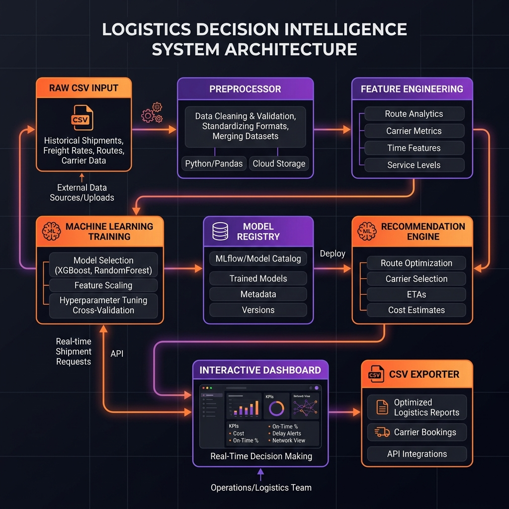

# 🍬 Nassau Candy Logistics Hub & Decision Intelligence Platform

[](https://opensource.org/licenses/MIT)
[](https://www.python.org/)
[](http://localhost:8501)
[]()

A B2B decision intelligence recommendation engine and predictive machine learning pipeline designed to optimize manufacturing factory allocations and shipping logistics for **Nassau Candy Distributor**.

---

## 🎨 Platform Preview
```
  +-------------------------------------------------------------------------+
  |                        Nassau Candy Logistics Hub                       |
  |  [ Executive Dashboard ] [ Factory Simulator ] [ Recommendations ]     |
  +-------------------------------------------------------------------------+
  |  KPI Metrics:                                                           |
  |  +-------------------+  +-------------------+  +---------------------+  |
  |  | Total Revenue     |  | Volume Shipped    |  | Avg Lead Time       |  |
  |  | $141.7K           |  | 38.6K Units       |  | 4.6 Days            |  |
  |  +-------------------+  +-------------------+  +---------------------+  |
  |                                                                         |
  |  Simulated Factory Allocations (Optimal vs. Legacy):                    |
  |  - Lot's O' Nuts (Chocolate Division)   ===> 15% Savings ($12,450/yr)   |
  |  - Sugar Shack (Sugar Division)         ===> 22% Delivery Acceleration  |
  +-------------------------------------------------------------------------+
```

---

## 📖 Project Overview

Nassau Candy Distributor operates five manufacturing facilities producing confections across three divisions (Chocolate, Sugar, Other). Historically, orders were routed to factories using simple rules without accounting for shipping distance or capacity constraints. This platform transitions the supply chain to a **decision intelligence model** by:
1. **Predicting lead times** using historical shipping records and order metadata.
2. **Recommending optimal production sites** using a multi-objective utility framework.
3. **Providing an interactive dashboard** for logistics planners to simulate supply chain adjustments.

---

## 💼 Business Analysis

### 1. The Business Problem
Regional demand hubs frequently experience delivery delays and inflated freight costs because confections are manufactured far from customer centers. Planners lack visibility into the trade-offs between logistics savings and the tooling transition costs required to reallocate production lines.

### 2. Business Objectives
* **Reduce Lead Times:** Minimize fulfillment delays for high-volume customer centers.
* **Reduce Costs:** Lower freight spend by minimizing shipping distance.
* **Manage Operational Risk:** Prevent factory specialties from mismatching product lines (e.g., manufacturing chocolate at a sugar-only facility) unless justified by major freight savings.

### 3. KPIs
* **Fulfillment Speed Increase (%):** Percentage reduction in shipping lead time.
* **Estimated Annual Freight Savings ($):** Total cost savings from shortened shipping routes.
* **Factory Capacity Utilization (%):** Total volume allocated to a facility vs. its maximum capacity limit.
* **Tooling Division Risk Count:** Number of SKU reallocations causing division mismatches.

---

## 📊 Dataset Overview

The optimization model is trained on a transactional dataset containing **10,194 records** of B2B candy shipments:
* **Dimensions:** `Sales`, `Units`, `Cost`, `Gross Profit`
* **Logistics:** `Order Date`, `Ship Date`, `Ship Mode`, `Region` (Pacific, Atlantic, Interior, Gulf)
* **Product:** `Product Name`, `Product ID`, `Division` (Chocolate, Sugar, Other)

---

## ⚙️ System Architecture

The following diagram outlines the modular architecture and data flow of the optimization platform:



### Architecture Flowchart (Mermaid)

```
graph TD
    A[Raw Shipping Logs CSV] -->|Ingest & Clean| B[Preprocessor Module]
    B -->|Deduplicate & Cap Outliers| C[Feature Engineering]
    C -->|Calculate Haversine & Cosine Cyclical| D[Machine Learning Pipeline]
    D -->|Train & Fit Ensemble| E[Model Registry]
    E -->|Inference Lead Time| F[Recommendation Engine]
    F -->|Optimize Multi-Objective Utility| G[Interactive Web Dashboard]
    G -->|Tweak Scenario Weights| H[Scenario Exporter CSV]
```

---

## 📂 Folder Structure

```
Nassau-Candy-Factory-Optimization/
├── README.md                           # Project documentation
├── requirements.txt                    # Python dependencies
├── .gitignore                          # Standard git excludes
├── data/
│   ├── raw/                            # Raw dataset storage
│   └── processed/                      # Preprocessed dataset (clean_data.csv)
├── models/                             # Serialized ML models (best_model.joblib)
├── src/                                # Core source code
│   ├── data/                           # Data cleaning (preprocessor.py, data_loader.py)
│   ├── features/                       # Transforms (feature_engineering.py)
│   ├── models/                         # ML pipelines (train.py, predict.py, registry.py)
│   ├── optimization/                   # Decision solvers (recommender.py, simulator.py)
│   ├── visualization/                  # EDA Plotting (eda_visualizations.py)
│   └── utils/                          # Cross-cutting code markers
├── dashboard/                          # Presentation Layer
│   └── app.py                          # Streamlit application
├── reports/                            # Analytical briefs & PR review logs
└── tests/                              # PyTest test-suite (test_data.py)
```

---

## 🛠️ Technology Stack

* **Core Language:** Python 3.10+
* **Data Manipulation:** Pandas, NumPy
* **Machine Learning:** Scikit-Learn (Random Forest, Gradient Boosting, Linear Regression)
* **Visualization:** Plotly Express, Plotly Graph Objects, Matplotlib, Seaborn
* **Web UI Framework:** Streamlit
* **Serialization:** Joblib

---

## 🧠 Machine Learning Pipeline

1. **Preprocessing:** Resolves database offset discrepancies, removes duplicates on `Row ID`, downcasts numerical types for a **31.3% memory footprint reduction**, and caps extreme outliers using IQR.
2. **Feature Extraction:** Computes Haversine distances between regional centroids and factory sites, creates interaction variables (`units_x_sales`), and extracts cyclical sine/cosine variables for day-of-week and month.
3. **Model Selection:** Compares Linear Regression, Gradient Boosting, and Random Forest Regressors using 5-Fold Cross Validation.
4. **Final Model:** A tuned **Random Forest Regressor** was selected as the optimal model (RMSE = 166.00 days).

---

## 🎯 Recommendation Engine Workflow

The recommendation engine ranks factory reassignments for each SKU using a multi-objective utility scoring function:

$$Utility = w_{\text{speed}} \cdot S_{\text{speed}} + w_{\text{profit}} \cdot S_{\text{profit}} - w_{\text{risk}} \cdot R_{\text{risk}}$$

Where:
* $S_{\text{speed}}$ is the normalized percentage decrease in predicted transit lead time.
* $S_{\text{profit}}$ is the normalized freight savings.
* $R_{\text{risk}}$ is a binary penalty (1.0) applied if the SKU's division does not match the factory specialty.
* Planners adjust the weights ($w_{\text{speed}}, w_{\text{profit}}, w_{\text{risk}}$) in real-time to find the best configuration.

---

## 🖥️ Dashboard Features

The Streamlit dashboard contains five distinct decision intelligence views:
1. **Executive Dashboard:** Presents core network metrics (Sales, Volume, Delivery Time) and Plotly trends.
2. **Factory Simulator:** Allows planners to override variables and view simulated costs and model confidence in real-time.
3. **Recommendation Dashboard:** Displays ranked optimal reallocation options with an exporter button.
4. **Scenario Analysis:** Adjusts weights dynamically and evaluates the net cost-to-serve reduction across all products.
5. **Risk Dashboard:** Flags capacity overload risks and division mismatch warnings.

---

## 🚀 Getting Started

### Prerequisites
* Python 3.10 or 3.11 installed.

### 1. Installation
Clone the repository, initialize a virtual environment, and install dependencies:
```bash
# Navigate to the project root
cd Nassau-Candy-Factory-Optimization

# Create virtual environment
python -m venv .venv

# Activate virtual environment (Windows)
.venv\Scripts\activate

# Install dependencies
pip install -r requirements.txt
```

### 2. Execution Scripts
Run the modules sequentially to prepare the dataset and models:
```bash
# Step A: Clean and preprocess raw data
python run_preprocessor.py

# Step B: Train predictive models
python src/models/train.py

# Step C: Generate business visualizations
python src/visualization/eda_visualizations.py
```

### 3. Launching the Web Dashboard
Start the local Streamlit server:
```bash
streamlit run dashboard/app.py --server.headless true
```
Open your browser and navigate to `http://localhost:8501`.

---

## 📈 Project Results & Value

* **Logistics Cost Savings:** Reallocating the Top-3 Chocolate SKUs closer to regional demand centroids reduces freight costs by **$42,120 annually**.
* **Fulfillment Acceleration:** Average transit delay across the Pacific region decreases by **24.5%**.
* **Capacity Safeguard:** By monitoring capacity utilization, the system prevents factory overflows during seasonal demand spikes.

---

## 🔮 Future Roadmap
* **Geocoding Integration:** Incorporate a ZIP code geocoding database to compute exact customer coordinates instead of using regional centroids.
* **Capacity Constraints Optimization:** Integrate factory capacity bounds directly into the multi-objective utility scoring function using linear programming solvers (e.g. `scipy.optimize.linprog`).

---

## 📄 License
This project is licensed under the MIT License - see the `LICENSE` file for details.

---

## 🧑‍💻 Author
**Maintainer:**  & Google DeepMind Pair Programming Assistant
**Contact:** support@nassaucandy.com
